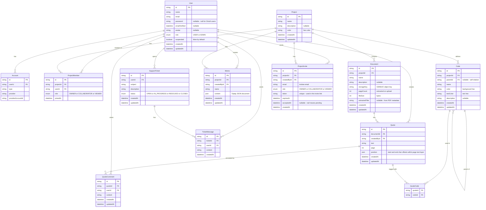

# Domain Model

This document describes all entities in QAnubis, their fields, relationships, and the reasoning behind key design decisions.

---

## Entity-Relationship Diagram



---

## Entities

### User

Represents a registered account. `password` is nullable because OAuth users (Google, GitHub) don't have a password. `role` controls access to the admin panel — only `ADMIN` users can access `/admin` routes. `suspended = true` blocks sign-in for that account; the admin panel toggles this flag.

`Account` is a NextAuth internal table — do not use it directly in application logic.

---

### Project & ProjectMember

A `Project` has no direct owner field. Ownership is expressed through `ProjectMember` with `role = OWNER`. This allows the owner role to be transferred in the future without schema changes.

**Role permissions:**

| Action | OWNER | COLLABORATOR | VIEWER |
|--------|-------|-------------|--------|
| View all content | ✅ | ✅ | ✅ |
| Create/edit/delete codes, quotes, memos | ✅ | ✅ | ❌ |
| Invite members | ✅ | ❌ | ❌ |
| Remove members / change roles | ✅ | ❌ | ❌ |
| Edit project settings | ✅ | ❌ | ❌ |
| Delete project | ✅ | ❌ | ❌ |

---

### ProjectInvite

Represents a pending invitation to join a project. The flow:

1. Owner creates an invite for an email address → a `ProjectInvite` row is created with a unique `token` and `expiresAt = now + 48 hours`.
2. An email is sent to the invitee with a link: `/invite?token=<token>`.
3. If the invitee has an account → they accept and a `ProjectMember` row is created.
4. If the invitee has no account → they sign up first, then are redirected to accept.
5. On acceptance, `acceptedAt` is set and the invite is considered consumed.

The `token` is a cryptographically random string, never the invite `id`. Expired or already-accepted invites are rejected. The same email can be re-invited after expiry.

---

### Document

`storageKey` stores the object path in S3/MinIO (e.g. `projects/abc123/documents/def456.pdf`), never a full URL. Presigned URLs are generated on demand when a user opens a document.

`pageCount`, `fileSize`, and `extractedTitle` are extracted server-side at upload time using `pdf-parse` (a CommonJS module wrapped in `src/lib/pdf.ts`). This means document listings never need to fetch from storage — they are fully served from the database. Extraction failures are non-fatal; defaults (0 pages, null title) are stored instead.

The full text content of the PDF is **not** stored. PDF.js extracts the text layer client-side when the document is opened in the viewer. Server-side text extraction would only be needed for full-text search, which is a v2 feature.

---

### Code

`parentId` is a self-relation that allows unlimited nesting depth. A code with `parentId = null` is a root-level code or category. The application does not enforce a maximum depth, but the UI tree visualization may have practical limits.

`color` and `textColor` are hex strings (e.g. `#E74C3C`, `#FFFFFF`). Both are required — the researcher defines them when creating a code.

---

### Quote & QuoteCode

`position` stores the character offsets within the PDF.js text layer for the selected page:

```json
{ "start": 142, "end": 310 }
```

This is sufficient to re-render the highlight overlay when the document is reopened. The `page` field is stored separately for quick filtering (e.g. "show all quotes on page 3").

`QuoteCode` is a pure join table — a quote can have multiple codes, and a code can be used in multiple quotes.

---

### Memo

`content` stores the Tiptap editor JSON document (not raw HTML). This allows structured editing and future rendering flexibility.

---

### SupportTicket & TicketMessage

Users open tickets from within the app. Admins respond via `TicketMessage`. The ticket `status` flow is:

```
OPEN → IN_PROGRESS → RESOLVED → CLOSED
```

Only admins can change ticket status. Users can add messages to any ticket they own while it is not `CLOSED`.

---

## Design decisions

### Why no `ownerId` on Project?

Ownership via `ProjectMember` (role = OWNER) keeps the model consistent — membership is always expressed in one place. It also allows ownership transfer without `ALTER TABLE`.

### Why store `pageCount` but not full text?

Page count is small (one integer) and enables the document listing UI with no storage calls. Full text can be megabytes per document — storing it would bloat the database and provide no benefit until v2 full-text search is implemented.

### Why character offsets for quote position?

Bounding-box coordinates (x/y/width/height) are tied to the zoom level at the time of selection and require recalculation on every render. Character offsets within the PDF.js text layer are stable across zoom levels and simpler to store. The highlight is re-derived from the offset when the viewer renders.

### Why Tiptap JSON for memo content?

Storing Tiptap's JSON (not HTML) keeps the content format separate from its presentation. If the editor or rendering library changes in the future, the raw content is still usable. HTML would embed rendering decisions into the stored data.
