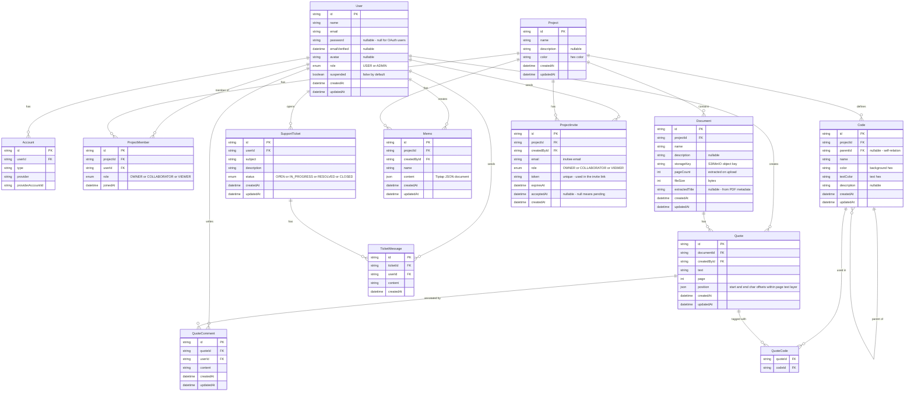

# Modelo de Domínio

Este documento descreve todas as entidades do QAnubis, seus campos, relacionamentos e o raciocínio por trás das principais decisões de design.

---

## Diagrama Entidade-Relacionamento



---

## Entidades

### User (Usuário)

Representa uma conta cadastrada. `password` é nullable porque usuários OAuth (Google, GitHub) não têm senha. `role` controla o acesso ao painel admin — apenas usuários `ADMIN` podem acessar as rotas `/admin`. `suspended = true` bloqueia o login daquela conta; o painel admin alterna esse flag.

`Account` é uma tabela interna do NextAuth — não a use diretamente na lógica da aplicação.

---

### Project & ProjectMember (Projeto e Membro)

Um `Project` não tem campo de proprietário direto. A propriedade é expressa através de `ProjectMember` com `role = OWNER`. Isso permite que o papel de proprietário seja transferido no futuro sem alterações de schema.

**Permissões por função:**

| Ação | OWNER | COLLABORATOR | VIEWER |
|------|-------|-------------|--------|
| Ver todo o conteúdo | ✅ | ✅ | ✅ |
| Criar/editar/excluir códigos, citações, memorandos | ✅ | ✅ | ❌ |
| Convidar membros | ✅ | ❌ | ❌ |
| Remover membros / alterar funções | ✅ | ❌ | ❌ |
| Editar configurações do projeto | ✅ | ❌ | ❌ |
| Excluir projeto | ✅ | ❌ | ❌ |

---

### ProjectInvite (Convite)

Representa um convite pendente para entrar em um projeto. O fluxo:

1. Proprietário cria um convite para um endereço de e-mail → uma linha `ProjectInvite` é criada com um `token` único e `expiresAt = agora + 48 horas`.
2. Um e-mail é enviado ao convidado com um link: `/invite?token=<token>`.
3. Se o convidado já tem conta → ele aceita e uma linha `ProjectMember` é criada.
4. Se o convidado não tem conta → ele se cadastra primeiro e então é redirecionado para aceitar.
5. Na aceitação, `acceptedAt` é definido e o convite é considerado consumido.

O `token` é uma string aleatória criptograficamente segura, nunca o `id` do convite. Convites expirados ou já aceitos são rejeitados. O mesmo e-mail pode ser re-convidado após o vencimento.

---

### Document (Documento)

`storageKey` armazena o caminho do objeto no S3/MinIO (ex: `projects/abc123/documents/def456.pdf`), nunca uma URL completa. URLs pré-assinadas são geradas sob demanda quando um usuário abre um documento.

`pageCount`, `fileSize` e `extractedTitle` são extraídos no lado do servidor no momento do upload usando `pdf-parse` (um módulo CommonJS encapsulado em `src/lib/pdf.ts`). Isso significa que a listagem de documentos nunca precisa buscar no armazenamento — é totalmente servida pelo banco de dados. Falhas na extração não são fatais; valores padrão (0 páginas, título null) são armazenados.

O conteúdo de texto completo do PDF **não é** armazenado. O PDF.js extrai a camada de texto no lado do cliente quando o documento é aberto no visualizador. A extração de texto no servidor só seria necessária para busca de texto completo, que é uma feature da v2.

---

### Code (Código)

`parentId` é uma auto-relação que permite profundidade de aninhamento ilimitada. Um código com `parentId = null` é um código ou categoria raiz. A aplicação não impõe profundidade máxima, mas a visualização em árvore na UI pode ter limites práticos.

`color` e `textColor` são strings hexadecimais (ex: `#E74C3C`, `#FFFFFF`). Ambos são obrigatórios — o pesquisador os define ao criar um código.

---

### Quote & QuoteCode (Citação)

`position` armazena os deslocamentos de caracteres dentro da camada de texto do PDF.js para a página selecionada:

```json
{ "start": 142, "end": 310 }
```

Isso é suficiente para re-renderizar o destaque quando o documento é reaberto. O campo `page` é armazenado separadamente para filtragem rápida (ex: "mostrar todas as citações da página 3").

`QuoteCode` é uma tabela de junção pura — uma citação pode ter múltiplos códigos, e um código pode ser usado em múltiplas citações.

---

### Memo (Memorando)

`content` armazena o documento JSON do editor Tiptap (não HTML bruto). Isso permite edição estruturada e flexibilidade futura de renderização.

---

### SupportTicket & TicketMessage (Chamado de Suporte)

Usuários abrem chamados de dentro da aplicação. Admins respondem via `TicketMessage`. O fluxo de `status` do chamado é:

```
OPEN → IN_PROGRESS → RESOLVED → CLOSED
```

Apenas admins podem alterar o status do chamado. Usuários podem adicionar mensagens a qualquer chamado que possuam enquanto não estiver `CLOSED`.

---

## Decisões de Design

### Por que não ter `ownerId` no Project?

Propriedade via `ProjectMember` (role = OWNER) mantém o modelo consistente — a associação é sempre expressa em um único lugar. Também permite a transferência de propriedade sem `ALTER TABLE`.

### Por que armazenar `pageCount` mas não o texto completo?

O número de páginas é pequeno (um inteiro) e habilita a UI de listagem de documentos sem chamadas ao armazenamento. O texto completo pode ter megabytes por documento — armazená-lo inflaria o banco de dados sem trazer benefício até que a busca de texto completo da v2 seja implementada.

### Por que deslocamentos de caracteres para a posição da citação?

Coordenadas de bounding-box (x/y/largura/altura) estão atreladas ao nível de zoom no momento da seleção e exigem recalculação a cada renderização. Deslocamentos de caracteres dentro da camada de texto do PDF.js são estáveis independentemente do zoom e mais simples de armazenar. O destaque é re-derivado do deslocamento quando o visualizador renderiza.

### Por que JSON do Tiptap para o conteúdo do memorando?

Armazenar o JSON do Tiptap (não HTML) mantém o formato do conteúdo separado de sua apresentação. Se o editor ou a biblioteca de renderização mudar no futuro, o conteúdo bruto ainda é utilizável. HTML incorporaria decisões de renderização nos dados armazenados.
